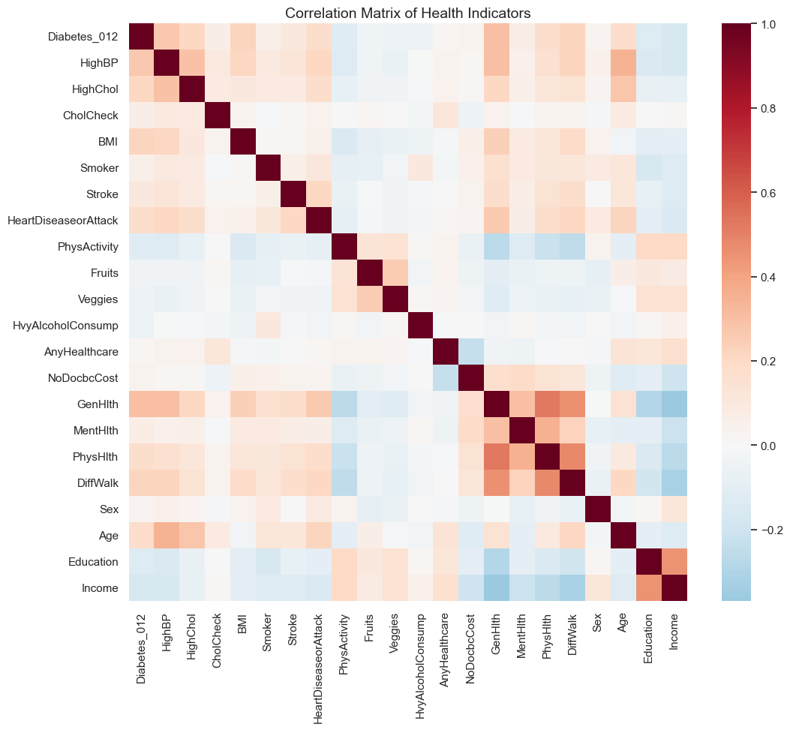

# Diabetes Risk Analysis - Data Portfolio Project

---

## Key Findings

### 1. Correlation Matrix of Health Indicators
The correlation matrix visualises relationships between health variables and diabetes.  
- Strong positive correlations highlight **major risk factors**.  
- Negative correlations highlight **protective factors**.  

---

### 2. Risk and Protective Factors
Based on correlations with diabetes:

- **Major Risk Factors:** BMI, High Blood Pressure, Heart Disease, Age, Smoking, High Cholesterol.  
- **Protective Factors:** Physical activity, fruit and vegetable intake, education, and income.  

These factors indicate areas where individuals might focus efforts to reduce risk.

---

### 3. Individual Risk Scores
Each person receives a **Risk Score**, summarising overall diabetes risk.

- **Distribution of Risk Scores:** Most individuals fall in the middle, while a smaller group shows higher risk.  

- **Average Risk Score by Diabetes Status:** Compares non-diabetic, pre-diabetic, and diabetic groups.  

---

### 4. Top At-Risk Individuals
The top 10 high-risk non-diabetic or pre-diabetic individuals are highlighted.  

- Focus is on **modifiable risk factors** that can be addressed through lifestyle changes.  

  

*Commentary:* High BMI, smoking, and high blood pressure are common among these individuals.

---

### 5. Risk vs Protective Factors
Shows the relative influence of risks and protections on overall diabetes risk:

- **Risk Factors Distribution:** BMI and age have the largest contribution.  

- **Protective Factors Distribution:** Physical activity and diet help mitigate risk, though effects are smaller than the top risk factors.  

---

### 6. Income Analysis
Income is largely fixed but provides context for risk:

- **Average Risk Score by Income Group:** Lower-income groups have slightly higher average risk.  

- **Diabetes Status Distribution by Income Group:** Shows prevalence of normal, pre-diabetes, and diabetes across income groups.  
  

*Commentary:* While income is associated with risk, lifestyle interventions remain the most actionable approach.

---

## Recommendations

- **Target modifiable risk factors:** Reducing BMI, quitting smoking, managing blood pressure, and controlling cholesterol.  
- **Enhance protective factors:** Regular physical activity and increased fruit/vegetable intake.  
- **Income-related risk:** While diffic
