#  Diabetes Risk and Protective Factor Analysis

##  Project Overview

This project analyses the **2015 Behavioural Risk Factor Surveillance System (BRFSS)** dataset to identify the factors most strongly associated with diabetes.  
The workflow moves from exploratory analysis to feature engineering, risk scoring, stratified profiling, and model evaluation — with all outputs saved to `images/` and `tables/` for reproducibility and portfolio presentation.

---

## 1. Correlation Matrix & Key Insights
I computed Pearson correlations between all numeric features and diabetes status.

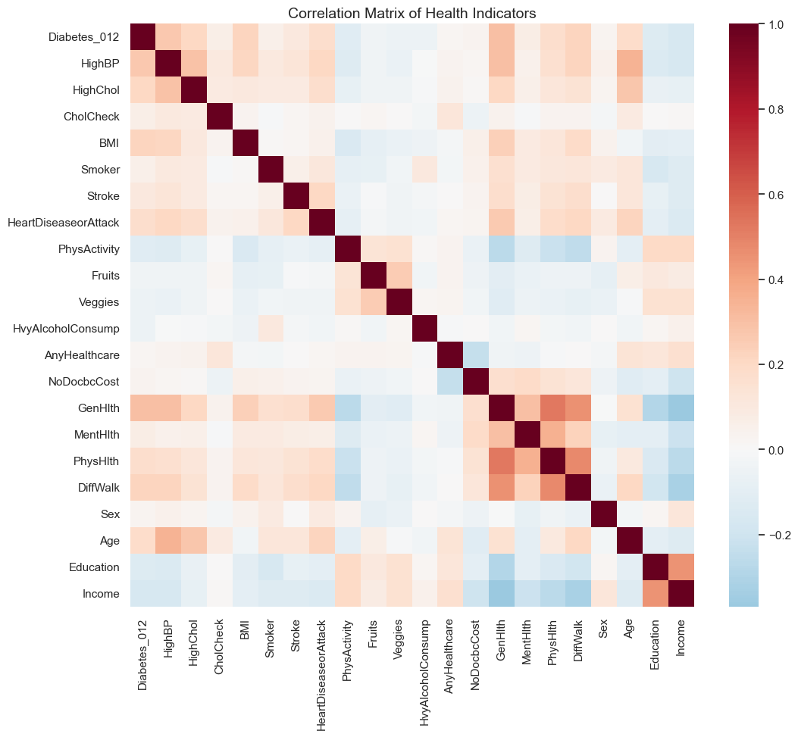

**Key Insights:**
- **Strongest risk factors**: `DiffWalk` (~0.34), `PhysHlth` (~0.30), `GenHlth` (~0.28), `HighBP` (~0.27), `HeartDiseaseorAttack` (~0.25), `Stroke` (~0.20)
- **Strongest protective factors**: `Income` (-0.14), `Education` (–0.13)
- **Lifestyle factors**: modest protection from `Veggies`, `PhysActivity`, `Fruits`
- **Healthcare access**: `AnyHealthcare` and `CholCheck` show positive correlation — likely reverse causality
- **Heavy alcohol**: flagged as a *protective* factor — explored next

📄 [Risk Factors Table](tables/risk_factors.csv)  
📄 [Protective Factors Table](tables/protective_factors.csv)

---

## 2. Heavy Alcohol Consumption Analysis
### By Diabetes Status
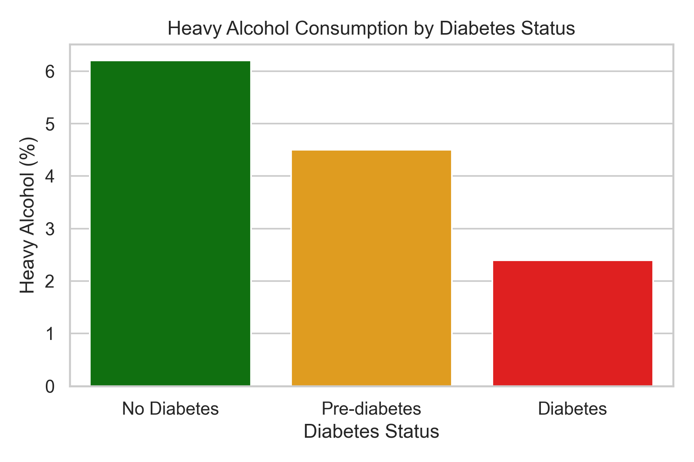  
📄 [Table](tables/heavy_alcohol_by_status.csv)

**Insight:** Heavy drinking is most common in non-diabetics (~6–7%), drops in pre-diabetes (~4–5%), and lowest in diabetes (~2–4%). Likely reflects behaviour change post-diagnosis or under-reporting.

### By Income Group
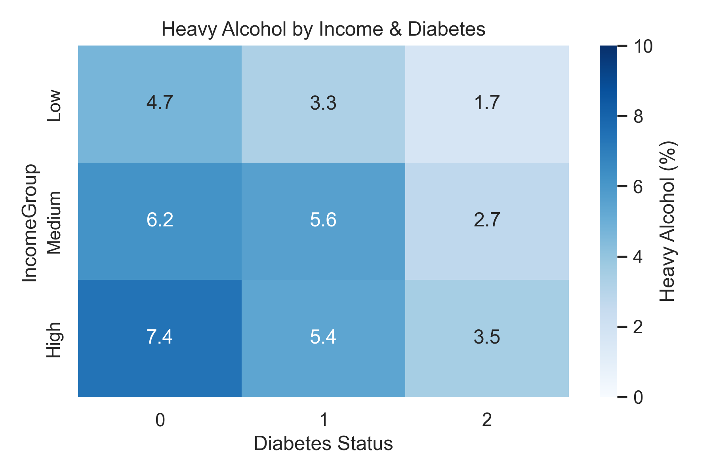  
📄 [Table](tables/income_vs_heavy_drinker.csv)

**Insight:** Higher-income groups drink more when healthy but show the sharpest drop after diagnosis.

### By Age Group
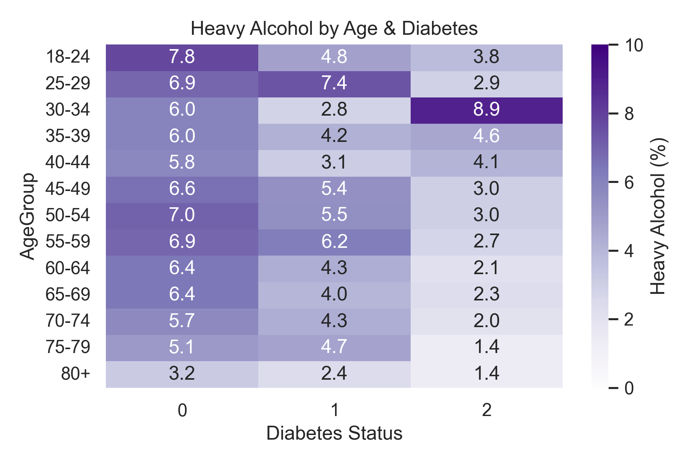  
📄 [Table](tables/stratified_agegroup_vs_diabetes.csv)

**Insight:** Youngest adults have the highest heavy-drinking rates when healthy, but all age groups decline with worsening diabetes status.

### By Sex
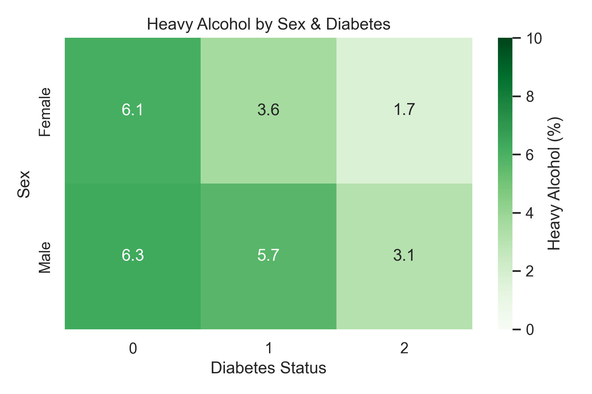  
📄 [Table](tables/stratified_sex_vs_diabetes.csv)

**Insight:** Men consistently report higher heavy drinking than women at every diabetes stage.

---

## 3. Composite RiskScore & 10% Overlay
I standardised risk/protective features, computed `RiskScore = Σ(risk z-scores) – Σ(protective z-scores)`, and classified into Low, Medium, High.

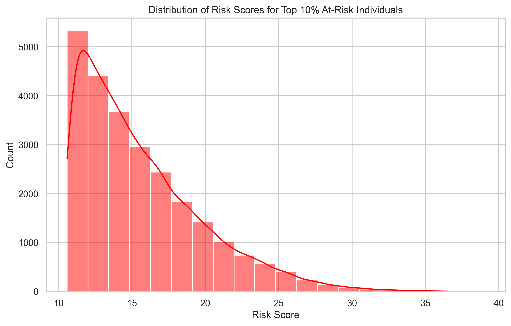  
📄 [Risk Level Summary](tables/risklevel_summary.csv)

**Insight:** The top 10% of scores represent the highest-risk individuals — focus for targeted intervention.

---

## 4. Average RiskScore by Diabetes Status
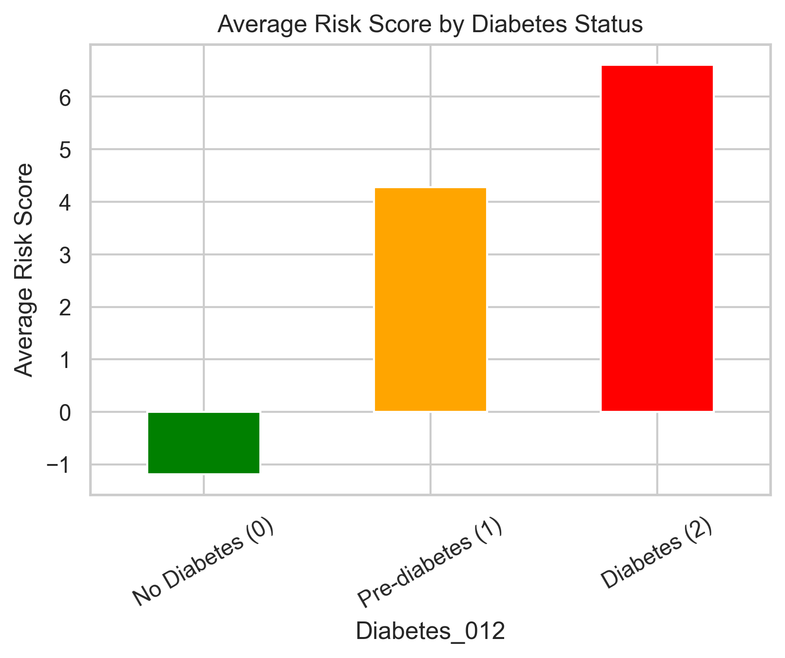  
📄 [Table](tables/avg_risk_by_status.csv)

**Insight:** Pre-diabetes scores are closer to diabetes than to no-diabetes — signalling early intervention potential.

---

## 5. Top 10 High-Risk Individuals
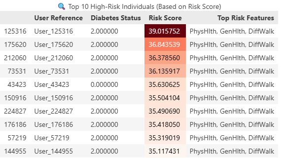
📄 [Top Risk Features](tables/top_risk_features.csv)

**Insight:** Most top scorers are diabetics, but one non-diabetic appears — poor health and mobility can elevate risk even without diagnosis.

---

## 6. Complication Risk Table (Top 10% by Status)
📄 [High-Risk Non-Diabetics](tables/highrisk_nondiabetic.csv)  
📄 [High-Risk Pre-Diabetics](tables/highrisk_prediabetic.csv)  
📄 [High-Risk Diabetics](tables/highrisk_diabetic.csv)

**Insight:**  
- **Non-Diabetics:** Preventive screening & lifestyle support  
- **Pre-Diabetics:** Prevention programmes  
- **Diabetics:** Integrated complication management

---

## 7. Income & Inequality
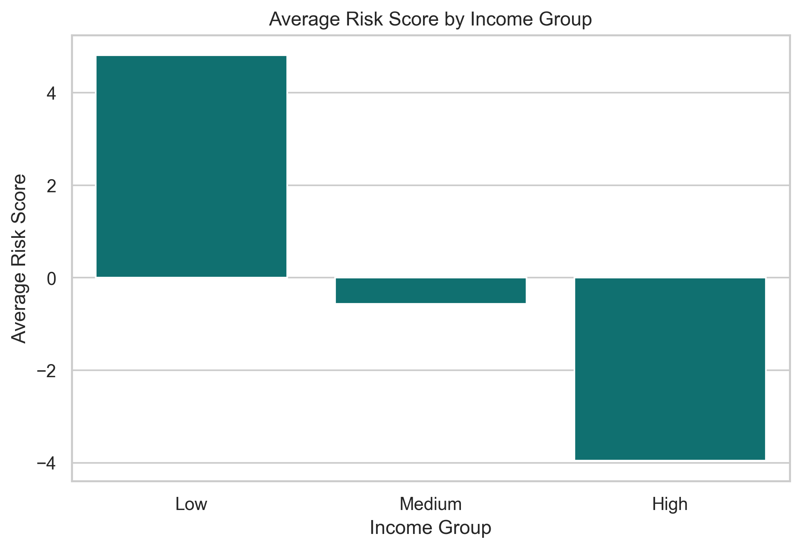  
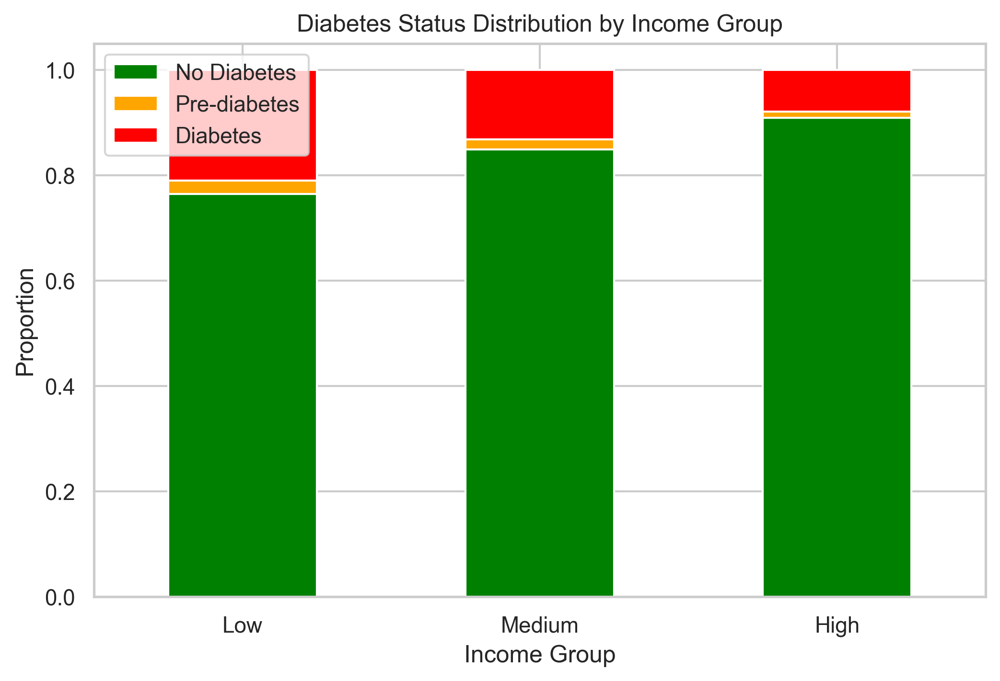

**Insight:** Higher income → lower risk and prevalence; lower income → higher prevalence and concentration of high-risk individuals.

---

## 8. Risk & Protective Factor Boxplots + Outliers
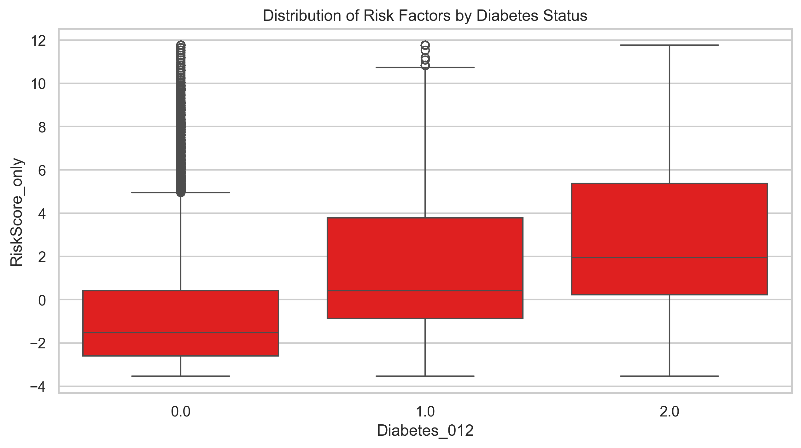  
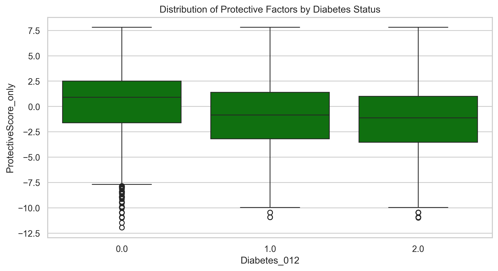

**Outlier Tables:**  
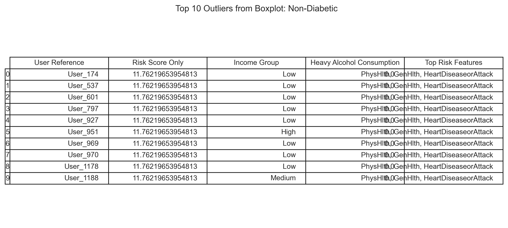  
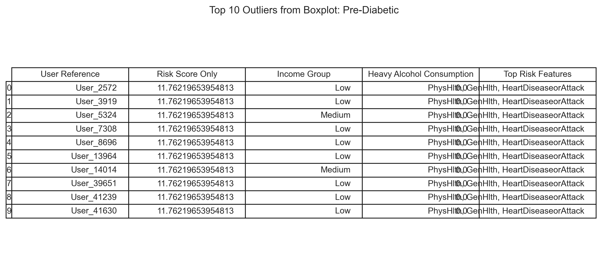

**Insight:** Outliers often have poor physical/general health and cardiovascular history, belong to low-income groups, and report no heavy alcohol use.

---

## 9. Model Performance
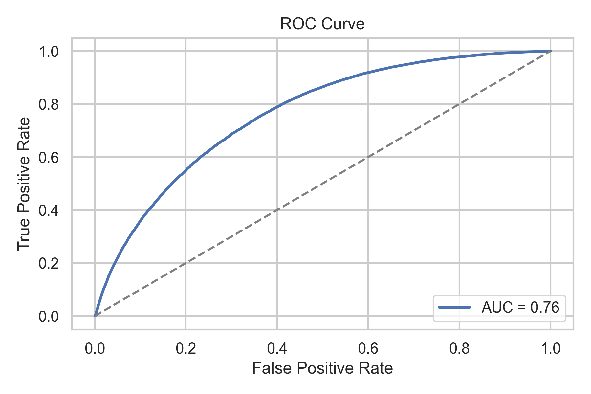  
📄 [Classification Report](tables/classification_report.csv)  
📄 [Logistic Regression Coefficients](tables/logit_diabetes_binary.csv)

**Insight:** Accuracy 84%, ROC AUC 0.76, high precision but low recall — good at confirming positives, under-detects some cases.

---

## 🏥 Public-Health Recommendations
1. Identify top-decile RiskScore individuals  
2. Proactively offer tailored screening and support  
3. Address both clinical and structural barriers

---

##  Portfolio Highlights
- **Full-cycle workflow**: EDA → Feature Engineering → Risk Scoring → Modelling → Recommendations  
- **Reproducible outputs**: All visuals in `images/`, all tables in `tables/`  
- **Readable narrative**: Markdown storytelling without code  
- **Policy-ready insights**: Directly applicable to public-health strategy

## Recommended Next Steps

This analysis has surfaced several promising insights, but also raised important questions that warrant deeper investigation:

- **Clarify Temporal Relationships**  
  Explore whether certain health issues (e.g. difficulty walking, vision problems) tend to precede diabetes onset or emerge as complications. Longitudinal data or proxy indicators (e.g. age of symptom onset) could help untangle cause vs. consequence.

- **Stratify Risk by Demographics**  
  Examine how risk factors vary across age groups, gender, and ethnicity. Are younger individuals with high BMI showing early signs? Are certain symptoms more predictive in older adults?

- **Investigate Protective Factors**  
  Highlight individuals with elevated risk scores who remain non-diabetic. What patterns or behaviors might be buffering them? This could inform prevention strategies.

- **Functional Impact Analysis**  
  Assess how diabetes correlates with mobility, pain, and daily functioning. For example, does difficulty walking correlate more strongly with diagnosed diabetes, or is it already present in high-risk non-diabetics?

- **Model Interpretability & Communication**  
  Improve how composite scores and risk flags are explained. Consider adding plain-language summaries or visual keys to help clinicians and non-technical users interpret results.

- **Expand to Predictive Timelines**  
  If data permits, build models that estimate time-to-onset for diabetes based on current indicators. This could support more proactive care planning.

- **Feedback Loop for Clinical Use**  
  Engage with healthcare professionals to validate findings and refine outputs for real-world utility. Their input could guide which features to prioritize and how to present risk.

