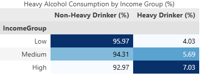

# 🩺 Diabetes Risk and Protective Factor Analysis

## 📌 Project Overview  
This project analyses data from the **2015 Behavioural Risk Factor Surveillance System (BRFSS)** to identify the factors most strongly associated with diabetes.  
Beyond building a predictive model, it uncovers **actionable insights** to guide public-health strategies.

Key contributions include:  
- Identifying **risk and protective factors** for diabetes  
- Creating a **composite RiskScore** to quantify individual-level risk  
- Stratifying risk across **income, age and sex groups**  
- Highlighting **socioeconomic disparities** in diabetes prevalence  
- Providing **policy-ready recommendations**  

---

## 🔎 Key Insights

### 1. Strongest Risk Factors  
- Difficulty walking (`DiffWalk`)  
- Days of poor physical health (`PhysHlth`)  
- Self-rated general health (`GenHlth`)  
- High blood pressure (`HighBP`)  
- Heart disease or attack (`HeartDiseaseorAttack`)  
- Stroke history (`Stroke`)  

  
**Download CSV**: [Correlation Matrix (CSV)](tables/correlation_matrix.csv)  

---

### 2. Protective Factors  
- **Income** and **Education**: strongest protection  
- **Lifestyle behaviours** (fruits, vegetables, physical activity) provide modest benefits  

  
**Download CSV**: [Protective Factors](tables/protective_factors.csv)  

---

### 3. Heavy Alcohol Consumption  
- **Non-diabetics**: ~6–7% heavy drinkers  
- **Pre-diabetes**: ~4–5%  
- **Diabetes**: ~2–4%  
- Sharpest declines in younger & higher-income groups  
- Men consistently drink more  

  
**Download CSV**: [Heavy Alcohol by Status](tables/heavy_alcohol_by_status.csv)

  
**Download CSV**: [Income vs Heavy Drinker](tables/income_vs_heavy_drinker.csv)

  
**Download CSV**: [Stratified by Age Group](tables/stratified_agegroup_vs_diabetes.csv)

  
**Download CSV**: [Stratified by Sex](tables/stratified_sex_vs_diabetes.csv)

---

### 4. Composite Risk Scoring  
**RiskScore** = sum(z-scores of risk factors) – sum(z-scores of protective factors)  
Risk levels:  
- **Low**: bottom 50%  
- **Medium**: 50th–90th percentile  
- **High**: top 10%  

  
**Download CSV**: [RiskLevel Summary](tables/risklevel_summary.csv)

---

### 5. RiskScore by Diabetes Status  
- **No Diabetes**: lowest average score  
- **Pre-Diabetes**: intermediate  
- **Diabetes**: highest  

  
**Download CSV**: [Average Risk by Status](tables/avg_risk_by_status.csv)

---

### 6. High-Risk Individuals  
Top 10% by RiskScore drive most of the diabetes burden. Key drivers include poor general health, poor physical health and difficulty walking.

  
**Download CSV**: [Top Risk Features](tables/top_risk_features.csv)

---

### 7. Outlier Profiles  
Flagged the highest outliers within non-diabetic and pre-diabetic groups for targeted outreach.

  

---

### 8. Stratified Risk Profiles  
- **Non-Diabetics** → preventive screening  
- **Pre-Diabetics** → prevention programmes  
- **Diabetics** → integrated care  

*(Full tables in `tables/stratified_*_vs_diabetes.csv`)*

---

### 9. Income and Inequality  
- Higher income → lower RiskScores & diabetes prevalence  
- Lower income → greater concentration of high-risk individuals  

  

---

### 10. Model Performance  
Baseline logistic regression:  
- **Accuracy**: 84%  
- **ROC AUC**: 0.76  
- **High precision, low recall**  

  
**Download CSV**: [Classification Report](tables/classification_report.csv)  
**Download CSV**: [Logistic Regression Coeffs](tables/logit_diabetes_binary.csv)

---

## 🏥 Public-Health Recommendations  
Use this framework to:  
1. Identify **top-decile RiskScore individuals**  
2. Proactively offer **tailored screening and support**  
3. Address both clinical markers and **structural barriers**  

---

## 🛠️ Tools Used  
- **Python**: Pandas, NumPy, Matplotlib, Seaborn, Scikit-learn, Statsmodels  
- **Jupyter Notebook** for reproducible analysis  
- **Modular code** with clear markdown and organised outputs  

---

## 📌 Why This Project Matters  
Demonstrates a **full-cycle data-science workflow**—from data exploration through modelling to policy-ready recommendations—bridging **data and impact** in public health.  
