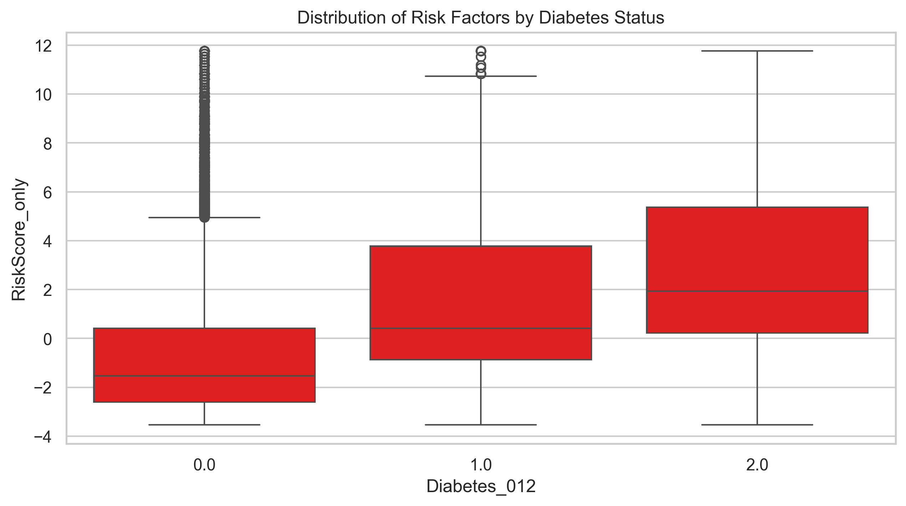
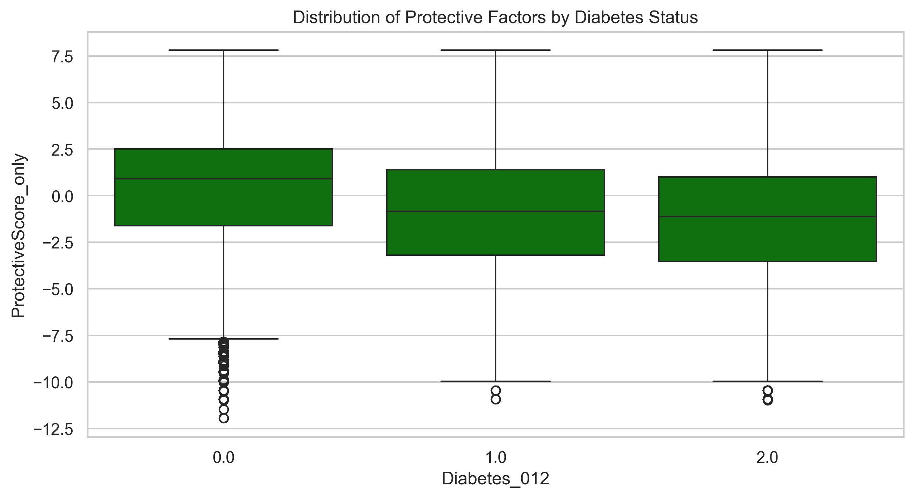
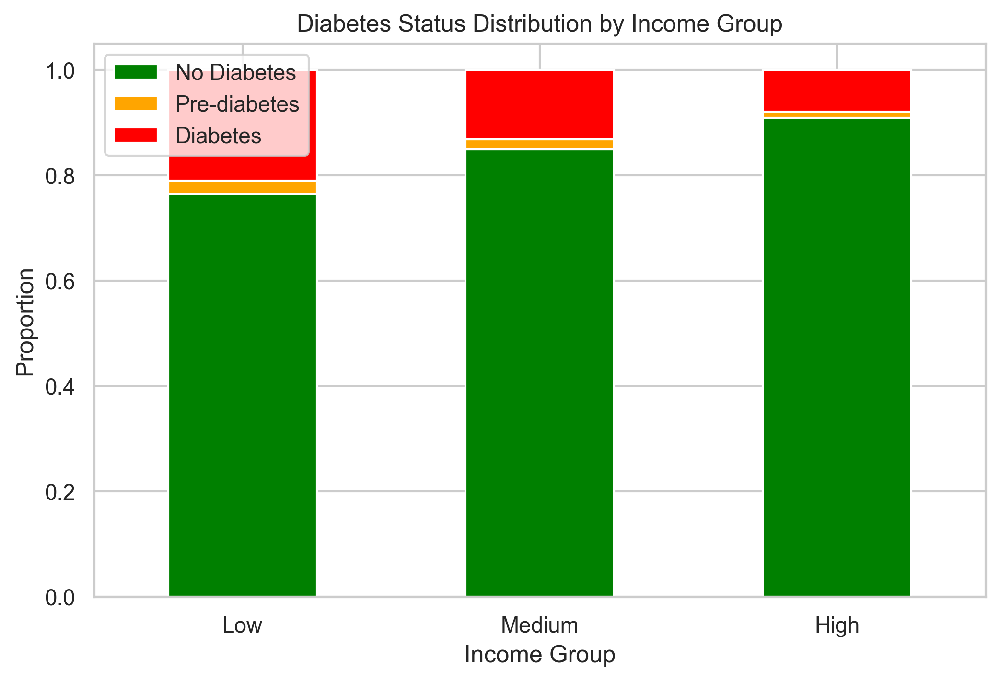

````markdown
# Diabetes Risk Analysis - Data Portfolio Project  

## Introduction  
This project analyses health and lifestyle data to identify **key risk and protective factors for diabetes**. Using **Python, Pandas, and data visualisation tools**, the analysis highlights correlations between health indicators, computes individual risk scores, and identifies high-risk groups.  

The goal of this project is to demonstrate practical data analysis skills, from **data wrangling and statistical analysis** through to **dashboard-ready visualisations and actionable insights**.  

---

## Tech Stack  

- **Python** – core analysis and data processing  
- **Pandas / NumPy** – data manipulation and calculations  
- **Matplotlib / Seaborn** – charts and visualisations  
- **Scikit-learn** – data standardisation and scoring  
- **Jupyter Notebook** – exploratory analysis  
 

---

## How to Run the Project  

1. **Clone the repository**  
   ```bash
   git clone https://github.com/Leonw98/DiabetesRiskAnalysis.git
   cd DiabetesRiskAnalysis
````

2. **Install dependencies**

   ```bash
   pip install -r requirements.txt
   ```

3. **Run the analysis script**

   ```bash
   python diabetes_full_pipeline.py
   ```

4. **View results**

   * Charts and visualisations are saved in the **`Images/`** folder.
   * Key findings are summarised in this README.

---

## Key Findings

### 1. Correlation Matrix of Health Indicators

The correlation matrix visualises relationships between health variables and diabetes.


Direct health conditions show the strongest link to diabetes, while diet and lifestyle are important but play a more subtle role. For instance, fruit and vegetable consumption, though universally regarded as important, appears to have less of a positive effect than income. This may be because reported intake of fruit and vegetables is more subjective than some of the other health-related questions.
---

### 2. Risk and Protective Factors

Based on correlations with diabetes:

* **Major Risk Factors:** BMI, High Blood Pressure, Heart Disease, Age, Smoking, High Cholesterol.
* **Protective Factors:** Physical activity, fruit and vegetable intake, education, and income.

---

### 3. Individual Risk Scores

Since the dataset contains features with different ranges, I used StandardScaler to put them on the same scale and then computed a RiskScore as:

RiskScore = sum of standardized risk factors − sum of standardized protective factors.

Each person receives a **Risk Score**, summarising overall diabetes risk.

* **Distribution of Risk Scores:**
  

* **Average Risk Score by Diabetes Status:**
  
  
Most people in the dataset fall into the low to moderate risk category. However, a significant number are in the moderate risk group, and while fewer in number, there are unfortunately some individuals in the high-risk group, whom I will later identify for further intervention.
---

### 4. Top At-Risk Individuals

The top 10 high-risk non-diabetic or pre-diabetic individuals are highlighted.


*Commentary:* High BMI, smoking, and high blood pressure are common among these individuals.

---

### 5. Risk vs Protective Factors

* **Risk Factors Distribution:**
  

* **Protective Factors Distribution:**
  

---

### 6. Income Analysis

* **Average Risk Score by Income Group:**
  

* **Diabetes Status Distribution by Income Group:**
  

---

## Recommendations

* **Target modifiable risk factors:** Reduce BMI, quit smoking, manage blood pressure, and control cholesterol.
* **Enhance protective factors:** Increase physical activity and improve diet with more fruit/vegetable intake.
* **Income-related risk:** While income itself cannot be directly changed, targeted support for lower-income groups can help reduce disparities in outcomes.

---

✨ This project demonstrates how **data analysis can translate into meaningful health insights**, with a focus on **identifying high-risk individuals, guiding interventions, and improving outcomes**.

```

---

✅ Once you paste this into `README.md` (in the root of your repo), the images should render fine as long as the `Images/` folder and filenames are exactly as listed.  


